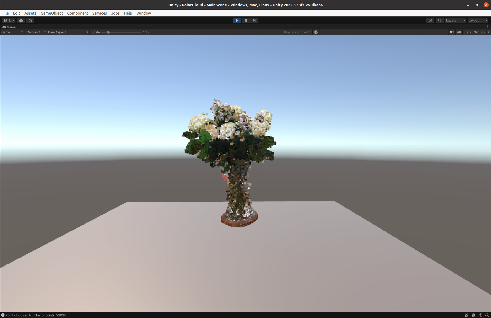
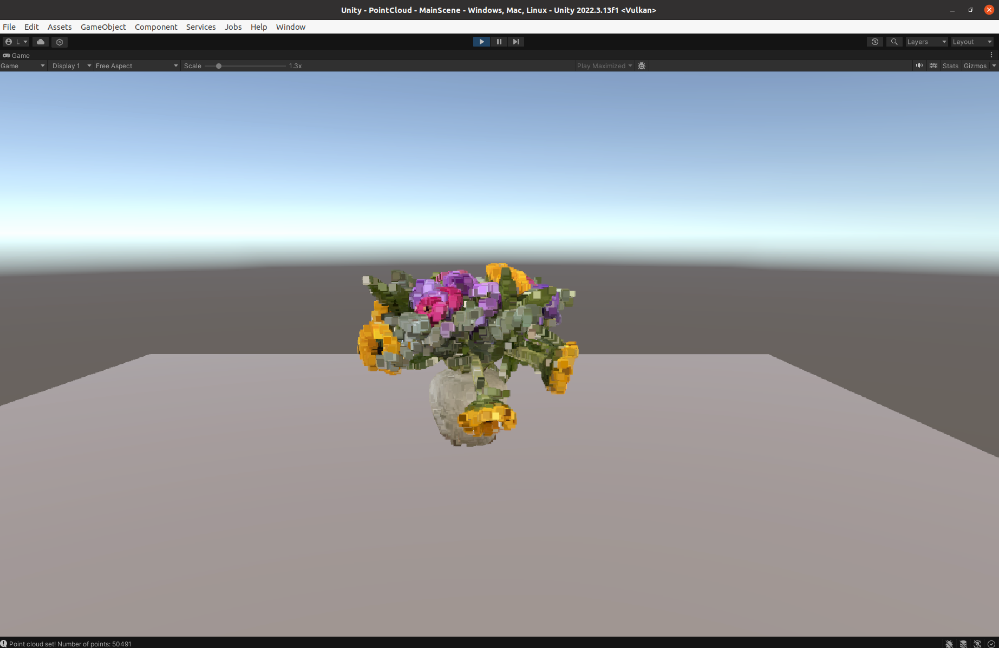

# Unity Point Cloud

Point Cloud Rendering in Unity.

## Features

* Using Built-in particles system for storing points from a point cloud. Idea based on: https://www.youtube.com/watch?v=y6KwsRkQ86U
* Implementing xyz rgb ACII point cloud reader
* Implementing PLY (`xyz nxnynz rgb`) point cloud reader
* Random sampling of point cloud to reduce memory requirements
* Rendering both positions and colors of point cloud

## Examples

Two point coulds from Sketchfab:

### 1. Point cloud of roses

"A point cloud of roses" (https://skfb.ly/6zWS8) by alban is licensed under Creative Commons Attribution (http://creativecommons.org/licenses/by/4.0/).

Original file: https://sketchfab.com/3d-models/a-point-cloud-of-roses-13495f32fe1340fe91fd35a42c0a76c3

Render: 

### 2. Flower Point Cloud Photogrammetry

"Flower Point Cloud Photogrammetry" (https://skfb.ly/6VQLY) by Moshe Caine is licensed under Creative Commons Attribution (http://creativecommons.org/licenses/by/4.0/).

Original file: https://sketchfab.com/3d-models/flower-point-cloud-photogrammetry-13a409d10f154d5dbfd009fe75d52222

Render: 

## Usage

1. Create ParticleSystem Unity object
2. In ParticleSystem disable `shape`
3. In ParticleSystem disable `emission`
4. In ParticleSystem disable `PlayOnAwake`
5. In ParticleSystem set `MaxParticles` to 100000
6. In ParticleSystem set `StartSpeed` to 0
7. Attach Script
8. Inside Script set path to point cloud path
9. Set `PointScale` and `PointCloudScale` script parameters
10. Set desired transformation of the ParticleSystem

## Problems

1. Slow for large number of points
2. Particles are not rotating to camera position

## 3rd Party

1. Using Unity Asset "FreeFlyCamera": https://assetstore.unity.com/packages/tools/camera/free-fly-camera-140739